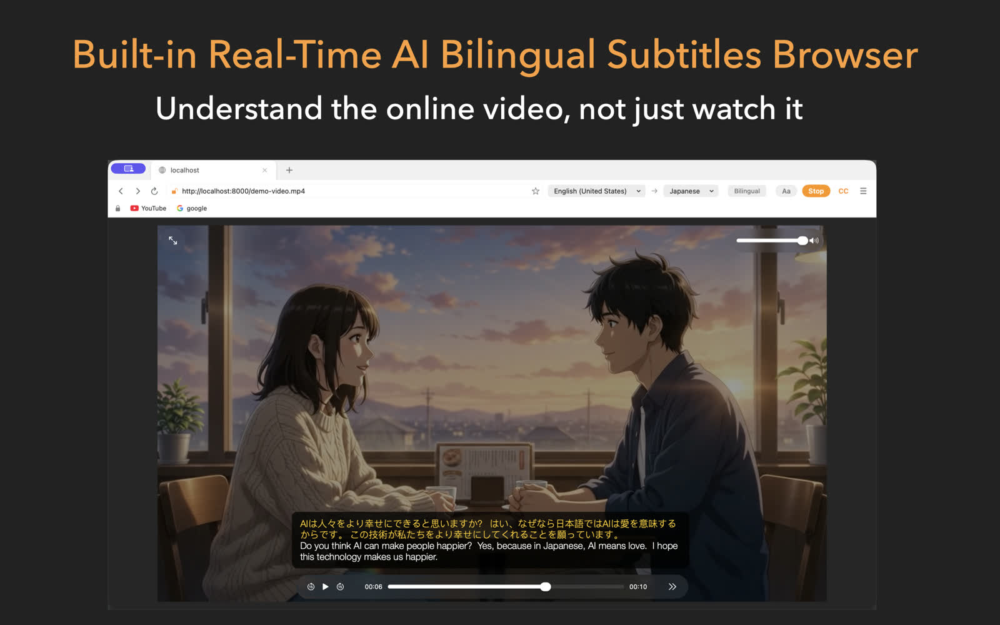

# KenjaBrowser

**Real-time bilingual captions for any web video — 100% on-device, on your Mac.**

[Website](https://kenjabrowser.kofukuai.com) · [Features](https://kenjabrowser.kofukuai.com/#features) · [Privacy Policy](https://kenjabrowser.kofukuai.com/privacy/)

## About

KenjaBrowser is a secondary browser for **macOS 26+** that adds real-time bilingual
subtitles to any online video — YouTube, news sites, online courses, live streams.
Speech recognition and translation run entirely on the device:

- Real-time bilingual captions (original speech + translation, side by side)
- 100% on-device AI — no uploads, no cloud, no tracking
- Built-in ad & tracker blocker
- Touch ID app lock and encrypted bookmark vault
- 14 recognition languages, 25 translation languages

Free to download on the Mac App Store.

## This repository

This repo hosts the **product website**, served by GitHub Pages at
**[kenjabrowser.kofukuai.com](https://kenjabrowser.kofukuai.com)** — a fully static,
dependency-free landing page: plain HTML + CSS + vanilla JS, self-hosted WebP/JPG
images and woff2 fonts, JSON-LD structured data, sitemap and robots.txt.

For the ops guide (pointing buttons at the App Store, replacing screenshots,
local preview), see **[MAINTAINING.md](MAINTAINING.md)**.
